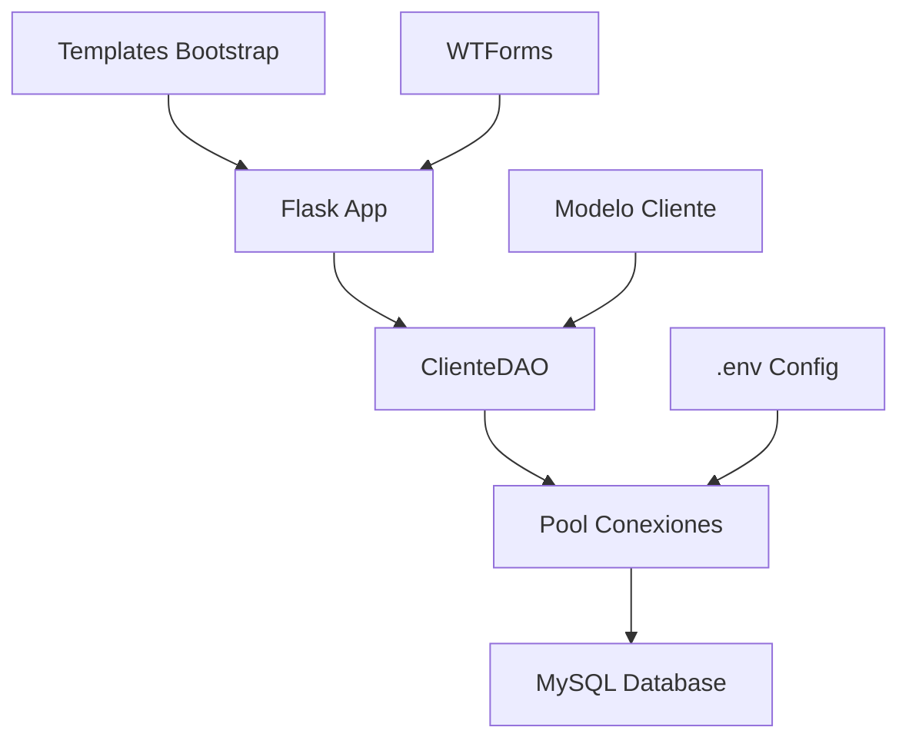
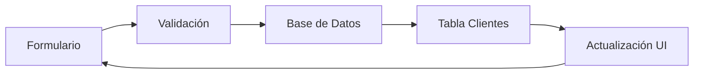

# 🚀 **Sistema de Gestión de Clientes - Flask Web App**


> *"Aplicación web segura para gestión de clientes con configuración cifrada, pool de conexiones y arquitectura empresarial"*

---

## 📸 **Capturas de Pantalla**

### 🏠 **Vista Principal**
| **Descripción** | **Vista** |
|-----------------|-----------|
| **Dashboard principal** con tabla de productos existentes en el sistema | <div align="center"><br/>*Tabla de productos con ID, descripción, precios y stock*</div> |


**Descripción de la Interfaz:**
- **Panel izquierdo**: Formulario de gestión de clientes con campos para Nombre, Apellido y Mail
- **Panel derecho**: Tabla de clientes registrados con datos de ejemplo
- **Botones de acción**: "Guardar" y "Limpiar" para gestionar el formulario
- **Diseño limpio**: Interfaz intuitiva con separación clara de funciones

---

## 🌟 **Características Principales**

### 🎨 **Interfaz de Usuario Moderna**
- ✅ **Diseño responsive** con Bootstrap 5.3
- 🎯 **Tema claro** integrado basado en la imagen
- 📱 **Interfaz intuitiva** y fácil de usar
- ⚡ **Navegación fluida** con funcionalidades CRUD

### 🔧 **Funcionalidades CRUD Completas**
- 👥 **Agregar nuevos clientes** con formularios validados
- 📋 **Listar todos los clientes** en tabla estructurada
- ✏️ **Editar información** de clientes existentes
- 🗑️ **Eliminar clientes** de forma segura
- 🧹 **Limpiar formularios** con botón dedicado

### 🔒 **Seguridad Avanzada**
- 🛡️ **Configuración cifrada** con variables de entorno
- 🔐 **Pool de conexiones** seguro y eficiente
- 📝 **Credenciales protegidas** en archivo .env
- 💾 **Persistencia robusta** con MySQL

---

## 🏗️ **Arquitectura del Sistema**



---

## 📁 **Estructura del Proyecto**

```
sistema-clientes-web/
├── app.py                 # 🚀 Aplicación Flask principal
├── Cliente.py            # 📊 Modelo de datos Cliente
├── ClienteDAO.py         # 🏗️ Data Access Object
├── Conexion.py           # 🔌 Pool de conexiones seguro
├── cliente_form.py       # 📝 Formularios WTForms
├── requirements.txt      # 📦 Dependencias
├── captures/            # 📸 Capturas de pantalla
│   └── image_6.png     # 🖼️ Vista principal
├── templates/           # 🎨 Frontend
│   └── index.html      # 🏠 Página principal
├── static/             # 🎭 Recursos estáticos
│   └── css/
│       └── styles.css # 🎨 Estilos personalizados
└── README.md           # 📚 Documentación
```

---
## 🔄 **Flujo de Trabajo**


---

## 🛠️ **Tecnologías Utilizadas**

### 🔧 Backend & Seguridad
- **Python 3.8+** - Lenguaje principal
- **Flask** - Microframework web
- **WTForms** - Validación de formularios
- **python-dotenv** - Gestión de variables entorno
- **mysql-connector-pool** - Pool de conexiones

### 🎨 Frontend
- **Bootstrap 5.3** - Framework CSS
- **HTML5** - Estructura semántica
- **Jinja2** - Motor de templates
- **CSS3** - Estilos personalizados

### 🗄️ Base de Datos
- **MySQL 8.0+** - Base de datos relacional
- **Connection Pooling** - Gestión eficiente
- **Patrón DAO** - Acceso abstracto a datos

---

## 🚀 **Instalación y Configuración**

### Prerrequisitos
```bash
# Python 3.8 o superior
python --version

# MySQL 8.0+
mysql --version
```

### ⚡ **Configuración Segura**
```bash
# 1. Clonar repositorio
git clone https://github.com/Astharmin/sistema-clientes-web.git
cd sistema-clientes-web

# 2. Crear entorno virtual
python -m venv venv
source venv/bin/activate  # Windows: venv\Scripts\activate

# 3. Instalar dependencias
pip install -r requirements.txt

# 4. Configurar variables de entorno
cp .env.example .env
# Editar .env con tus credenciales seguras

# 5. Ejecutar aplicación
python app.py
```

---

## 💾 **Esquema de Base de Datos**

```sql
CREATE TABLE cliente (
    id INT AUTO_INCREMENT PRIMARY KEY,
    nombre VARCHAR(100) NOT NULL,
    apellido VARCHAR(100) NOT NULL,
    mail VARCHAR(255) UNIQUE NOT NULL,
    fecha_creacion TIMESTAMP DEFAULT CURRENT_TIMESTAMP
);
```

---

## 🎯 **Ventajas de la Arquitectura Segura**

### 🔐 **Seguridad Empresarial**
- **Credenciales nunca en código** - Variables de entorno
- **Pool de conexiones** - Prevención de ataques DDoS
- **Validación de datos** - Prevención de inyecciones SQL
- **CSRF Protection** - Protección contra ataques cross-site

### ⚡ **Performance Optimizado**
- **Connection Pooling** - Reutilización de conexiones
- **Conexiones pre-establecidas** - Reducción de latencia
- **Gestión automática** de recursos

### 🔧 **Configuración para Producción**
```python
# Configuración lista para deployment
load_dotenv()  # Carga automática según entorno

class Conexion:
    DATABASE = os.getenv('DB_NAME', 'fallback_db')
    USERNAME = os.getenv('DB_USER', 'fallback_user')
    # ... resto de configuración segura
```

---

## 🎨 **Características de la Interfaz**

### ✨ **Diseño Basado en la Captura**
- **Tema claro** con estructura de dos secciones
- **Formulario lateral** para entrada de datos (como se ve en image_6.png)
- **Tabla de datos** para visualización de clientes registrados
- **Botones de acción** claramente definidos: "Guardar" y "Limpiar"

### 🔄 **Interacción Intuitiva**
```html
<!-- Formulario de cliente (basado en la captura) -->
<div class="form-group">
    <label for="nombre">Nombre</label>
    <input type="text" class="form-control" id="nombre" name="nombre">
</div>

<!-- Tabla de clientes -->
<table class="table table-striped">
    <thead>
        <tr>
            <th>ID</th>
            <th>Nombre</th>
            <th>Apellido</th>
            <th>Mail</th>
            <th>Acciones</th>
        </tr>
    </thead>
    <tbody>
        <!-- Datos dinámicos de clientes -->
    </tbody>
</table>
```

---

## 🔧 **Endpoints de la Aplicación**

| Ruta | Método | Descripción | Seguridad |
|------|--------|-------------|-----------|
| `/` | GET | Página principal | Pública |
| `/guardar` | POST | Guardar/Actualizar cliente | CSRF Token |
| `/editar/<id>` | GET | Cargar datos cliente | Validación ID |
| `/eliminar/<id>` | GET | Eliminar cliente | Validación ID |
| `/limpiar` | GET | Limpiar formulario | Pública |

---

## 📊 **Estructura de Datos**

### 🎫 **Modelo Cliente**
```python
class Cliente:
    def __init__(self, id=None, nombre="", apellido="", mail=""):
        self.id = id
        self.nombre = nombre
        self.apellido = apellido
        self.mail = mail
```

### 📋 **Ejemplo de Datos**
| ID | Nombre | Apellido | Mail |
|----|--------|----------|------|
| 1 | Daniel | Torres | dtorres@mail.com |
| 3 | Maria | Melo | mmelo@mail.com |
| 6 | Juan | Jimenez | jjimenez@mail.com |
| 7 | Rosa | Meliroso | rmeltroso@mail.com |
| 8 | Pedro | Melroso | pmeltroso@mail.com |

---

## 🚀 **Deployment Preparado**

### ☁️ **Listo para Producción**
- **Variables de entorno** para diferentes ambientes
- **Pool de conexiones** configurable
- **Error handling** robusto
- **Logging** para monitorización

### 🔄 **Escalabilidad**
```python
# Pool size configurable por entorno
POOL_SIZE = int(os.getenv('POOL_SIZE', 5))  # Desarrollo: 5, Producción: 20
```

---

## 🤝 **Contribución**

¿Te gustaría mejorar esta aplicación?

1. **Fork** el repositorio
2. Configura tu **.env** local
3. Crea una **rama feature** (`git checkout -b feature/NuevaCaracteristica`)
4. **Commit** tus cambios (`git commit -m 'Agregar NuevaCaracteristica'`)
5. **Push** a la rama (`git push origin feature/NuevaCaracteristica`)
6. Abre un **Pull Request**

**⚠️ Importante:** Nunca commits archivos .env con credenciales reales.

---

## 📄 **Licencia**

Este proyecto está bajo la Licencia MIT. Consulta el archivo [LICENSE](LICENSE) para más detalles.

---

<div align="center">

### ⭐ ¿Te gustó este proyecto? ¡Déjame una estrella en GitHub!

**Desarrollado con ❤️ por [Astharmin](https://github.com/Astharmin)**

---
