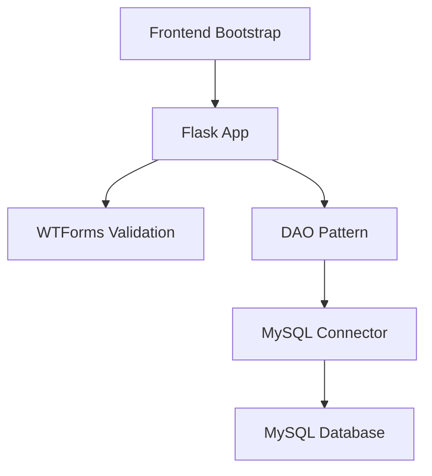

# 🚀 Flask User Registration API


> *"Sistema de registro de usuarios con arquitectura escalable, MySQL y interfaz moderna"*

## 🌟 Características Principales

### 🎯 Funcionalidades CRUD
- ✅ **Crear usuarios** con validación de formularios
- 📋 **Listar usuarios** en tabla responsive
- ✏️ **Editar registros** de los usuarios por ID
- 🗑️ **Eliminar usuarios** para su gestion de registros

## 🧑‍💻 Clonacion del Proyecto
```bash
# Clonar repositorio
git clone https://github.com/Astharmin/Login_UserApp.git

# Configurar conexión MySQL en Cliente_DAO.py
# Ejecutar aplicación
python app.py
```

## 🏗️ Arquitectura Profesional

